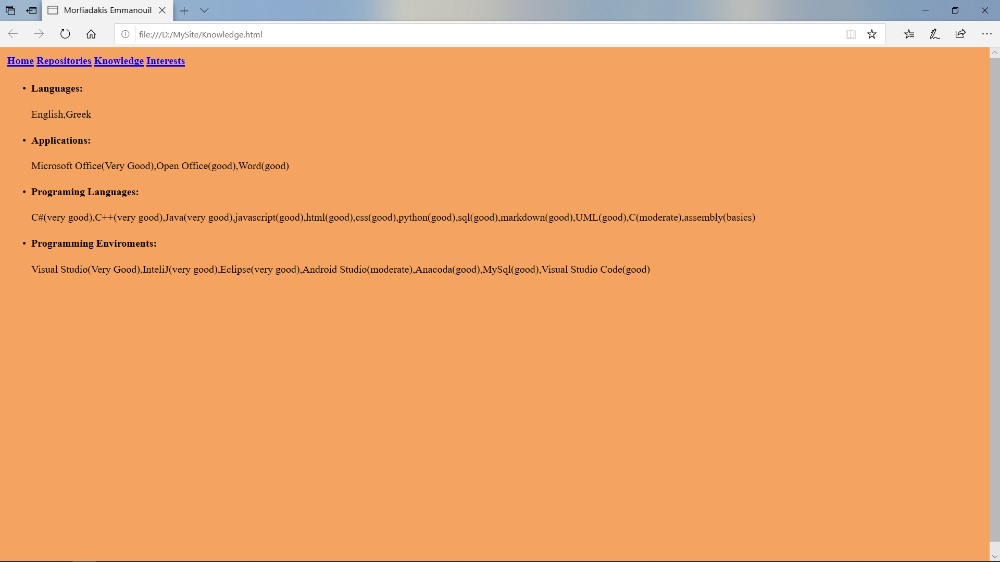
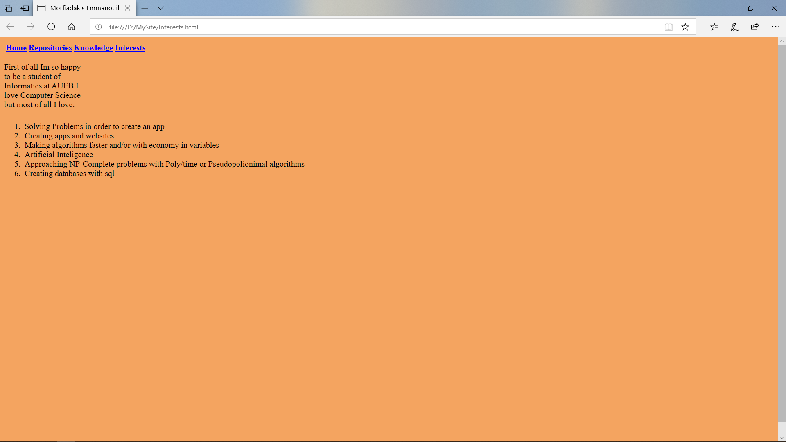

# My Site
## Greek
Εφτιαξα αυτό το Project για μένα για να εξοικειωθώ με την HTML και την CSS.Μπορείτε να δείτε τη δουλειά και είστε ευπρόσδεκτοι να προτείνετε ιδέες και τρόπους βελτίωσης της σελίδας.Ευχαριστώ!!

## English
I created this Project for me in orden to get familiar with HTML and CSS.You can see my work and you 're welcome to suggest new ideas and ways about how to improve the site.Thank you!!

## Main_Page

## Repositories

## Knowledge

## Interests

